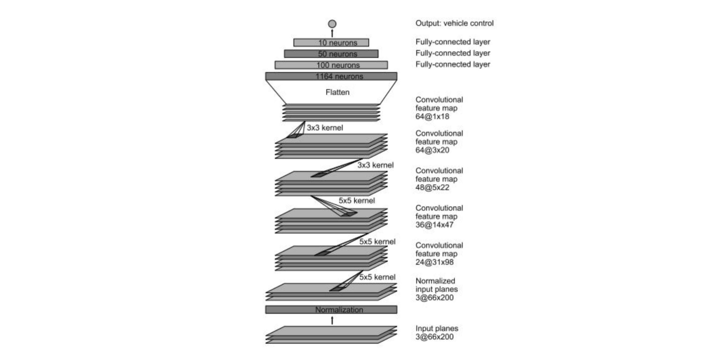
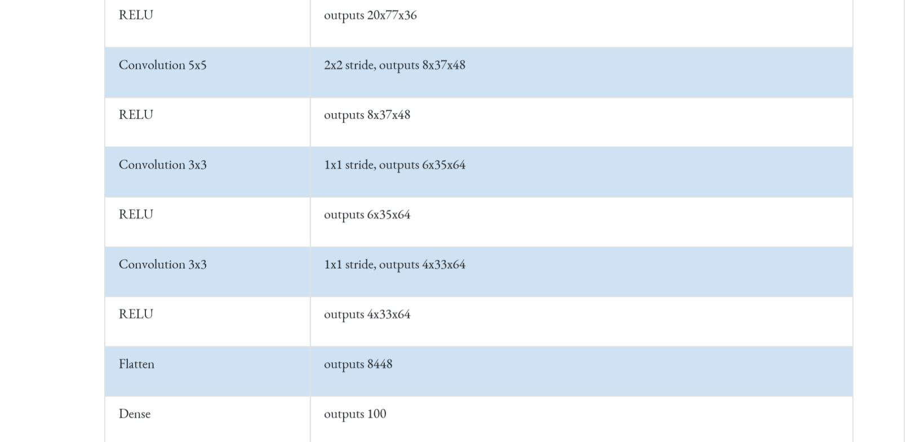

# Behavioral Cloning

Deep Neural Network modeled with Keras to clone human behavior of steering a car around a virtual track using camera images and OpenCV.


If you would teach someone how to drive, how would you go about it?
Would you tell them "if the car is not centered on the road, figure out the offset in meters and then compute the steering angle in radians to compensate the offset knowing that the car's yaw rate is the velocity divided by the distance between the two axels times the tangent of the steering angle"?
or would you say "just steer the car while driving around until you get the *feel* for it"?

This philosophy is at the core of my project. The idea was developed by the researchers at NVIDIA and is explained in this article: [https://devblogs.nvidia.com/deep-learning-self-driving-cars](​https://devblogs.nvidia.com/deep-learning-self-driving-cars/).

The end-to-end technique of steering a car is based on convolutional neural networks to map the raw pixels from front-facing cameras to the steering commands for a self-driving car.

I used Udacity's [simulator](https://github.com/udacity/self-driving-car-sim/releases) to manually drive the car around the lake track and record data from the front-facing cameras together with my own steering comands as labels. The data is used to train a convolutional neural network (CNN) that is further used to predict the necessary steering angle and drive the car autonomously around the same track.

This project is implemented in Python using Keras and OpenCV. The source code is located in `model.py` file above. 

To run the code, start the simulator and use `python drive.py model.h5` from the command line.

The starting code for this project is provided by Udacity and can be found [here](https://github.com/udacity/CarND-Behavioral-Cloning-P3).


## Data Aquisition

The simulator setup is the equivalent to the NVIDIA platform pictured below. Three cameras are used, one in the center and one on each side of the windshield. All three cameras are pointed towards the road ahead. 


Data is recorded while driving manually around the track. One recording will result in an `IMG` folder with pictures from all three cameras and a `driving_log.csv` file. In this repository I included data from driving a two laps, each in opposite direction: [fulllap](fulllap); [fulllapcounter](fulllapcounter).


The `driving_log.csv` has the following structure, providing images path and names and recorded comands. Only the `steering angle` is used from the recorded comands.


Given that multiple recording sessions are needed to build the data set, each path is used to load the data from the `csv` file and build a list with images names and labels.

```
csv_path = path + 'driving_log.csv'
img_folder_path = path + 'IMG/'
with open(csv_path) as csvfile:
    reader = csv.reader(csvfile)
    next(reader)
    for line in reader:
        #compose the relative location of images with respect of the current location
        relative_line = line
        #take the last part of the image line separated by '/' this is the image name
        center_img_name = line[0].split('/')[-1]
        #compose the image path by concatenating the folder path and image name
        center_img_path = img_folder_path + center_img_name
        #override the location of the center image
        relative_line[0] = center_img_path
```

For each recorded cycle, 6 images and labels are generated. The central image is initially used in its original form with the corresponding label from the recorded steering angle. The central image is then flipped around its vertical axis and the label's sign is reversed.

```
#CENTER
center_img = cv2.cvtColor(cv2.imread(batch_line[0]), cv2.COLOR_BGR2RGB)
images.append(center_img)
center_label = float(batch_line[3])
labels.append(center_label)
#flip image
flipped_img = cv2.flip(center_img, flipCode=1)
images.append(flipped_img)
#change label sign for flipped image 
flipped_label = (-1.0)* center_label
labels.append(flipped_label)
```

This data augmentation technique has proven to be very efficient. With one recorded image, the model learns to steer both left and right.
Not only that this approach doubles the data set, it helps in compensating for the left turning bias. The lake track in the simulation is a loop, mostly composed of left turns. Because of this, models trained without flipped images result in left steering even on straight road segments. 

 
Images from right and left cameras are also used in their original form, then flipped. Given that the left and right images are taken from different points of view, a correction factor is needed. 

```
#LEFT
correction  = 0.2
left_img = cv2.cvtColor(cv2.imread(batch_line[1]), cv2.COLOR_BGR2RGB)
images.append(left_img)
left_label  = center_label + correction
labels.append(left_label)
#flip image
flipped_img = cv2.flip(left_img, flipCode=1)
images.append(flipped_img)
#change label sign for flipped image 
flipped_label = (-1.0)* left_label
labels.append(flipped_label)
```

When running the model to predict steering angles, only the central camera is used. The left camera provides a shifted perspective. If the left image was seen from the central camera, the labeled steering angle needs to be adjusted to steer towards the right hand side of the road. The correction factor of `0.2` was chosen through trial and error.

This data augmentation technique is used to train the model for recovery situations in which the vehicle drifts to the side. The full laps provided with this repository were driven manually while generally keeping the car in the center of the road. Without the addition of left and right camera pictures, the model would not learn to steer the car from te side, back to the middle of the road. 

One could think that if the model was trained to drive on the middle of the road that the car will never end up off center. Nevertheless this happends due to imperfect predicted angles and recovery manouvers are essential for this neural network.
 
Even if data augmentation had a big impact it was still not enough to drive the vehicle all the way around the track. I encountered difficulties in sharp curves and I recorded those sections of the track multiple times. I did not include those recordings in this repository due to space limitations. 


## Model Architecture


Since this project is based on the research conducted by NVIDIA, I chose to use the model presented by them. 




This is a multilayer convolutional network that takes as input RGB images which are represented in 3 channels, normalizes the data and applies 5 layers of convolutions. At the top there are 3 fully connected layers that link to the output one value which represents the steering angle to control the vehicle. 

I adjusted the above model, and added a few layers to make it work for my track. I started by adding a `Cropping2D` layer to remove the top and bottom sections of the picture. These sections represent the car's hood and the track's background which and are not relevant for steering. 

```
model = Sequential()
#add cropping layer
model.add(Cropping2D(cropping=((50,20), (0,0)), input_shape=(160,320,3)))
```

Keeping only relevant data has a major impact in the model's performance. This implies that in autonomous mode, the car won't steer based on the shape of the trees or the rocks around. Initially, I thought that the landmarks could be useful and that they would serve as refference points for sharp curves. The experiments proved me wrong, so I kept the cropping layer.

Original image:


Cropped image:


The second layer is a Lambda layer used to normalize data. Normalized, zero centered data leads to better model performance. Weights and biases are easier train and assure loss minimisation.

```
#normalize data
model.add(Lambda (lambda x: (x / 255.0) - 0.5) )
```

These first two layers are not trainable, meaning that there are no nodes or weights and biases to train.

The model that was released by NVIDIA is composed by 5 consecutive convolutional layers followed by 3 consecutive fully connected layers. The convolutions start with a 5x5 kernel applied with a stride 2 on both vertical and horizontal directions. 

Normally I would have thought that having a stride of 2 would imply losing data and would have a lower performance. In fact, this is an application that detects and learns the shape of the road. This is different than detecting fine details in images like handwriting, so a stride 2 for 5x5 kernels works. There are 3 consecutive 5x5 convolution layers that boil down the data in the pictures and learn to extract the most relevant features like edges for example.

```
#layer 1- Convolution, no of filters- 24, filter size= 5x5, stride= 2x2
model.add(Conv2D(24, (5, 5), strides=(2, 2), activation="elu"))
#layer 2- Convolution, no of filters- 36, filter size= 5x5, stride= 2x2
model.add(Conv2D(36, (5,5), strides=(2, 2), activation="elu"))
#layer 3- Convolution, no of filters- 48, filter size= 5x5, stride= 2x2
model.add(Conv2D(48, (5,5), strides=(2, 2), activation="elu"))
#layer 4- Convolution, no of filters- 64, filter size= 3x3, stride= 1x1
model.add(Conv2D(64, (3,3), activation="elu"))
#layer 5- Convolution, no of filters- 64, filter size= 3x3, stride= 1x1
model.add(Conv2D(64, (3,3), activation="elu"))
```

Additionally there are 2 more convolutional layers with a kernel of 3x3 and striding of 1. These layers have a consistent height of 64 and do not skip data to learn associations between the selected characteristics of the road with the steering angle. Each convolution layer is followed by a rectified linear unit layer to allow for non linearity. 

At the top of the model there are 3 fully connected layers that are linked by the flattened result of the 5 convolutional layers. During training I noticed that the model was overfitting the data. This was visible throught the loss value that was decreasing and then increasing. I added a `Dropout` layer to reduce the overfitting.

```
#flatten image from 2D to side by side
model.add(Flatten())
#layer 6- fully connected layer 1
model.add(Dense(100, activation="elu"))
#dropout layer to avoid overfitting
model.add(Dropout(0.25))
#layer 7- fully connected layer 1
model.add(Dense(50, activation="elu"))
#layer 8- fully connected layer 1
model.add(Dense(10, activation="elu"))
#layer 9- fully connected layer 1
model.add(Dense(1))
```

I tried adding more than one dropout layer but the validation loss was not decreasing by so much and the car had a harder time driving around. So in the end I only kept one dropout layer after the Dense 100 fully connected layer. 

This is a very powerful model and rather simple and elegant at the same time given the complexity of the task of steering a car around the track.  





## Model Training

The dataset consists of  202830 labeled images. 80% of them were used for training, that means 162264. 20%  were used for validation.  

```
train_data, val_data = train_test_split(lines, test_size = 0.2)
```

The loss is calculated using mean squared error to minimize the deviation between the predicted steering angle and the one recorded while manually driving around the track. The `adam` optimizer is used to tune the hyperparameters like the learning rate. 

```
model.compile(loss='mse',optimizer='adam')
```

The model is fitted using a generator which yields pictures in batches of 128. The generator avoids the need of loading the entire batch in the RAM memory. Two epochs are enough, more induced overfitting in my case.

```
model.fit_generator(generator = data_generator(train_data),
                    validation_data = data_generator(val_data),
                    epochs = 2,
                    steps_per_epoch  = math.ceil(len(train_data) / 128),
                    validation_steps = math.ceil(len(val_data)   / 128)    )
model.save('model.h5')
```


## Simulation Video

Check out the video to see the car driving autonomously around the track. 

This view is through the images recorded by the central camera. 
You can download the video here: [video.mp4](video.mp4)

This view is from the simulator.

[](https://youtu.be/tOHwQpGa6ks)

 Click on the image to see the video!
